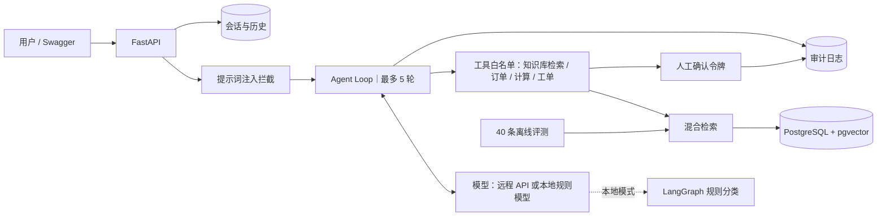

# 企业知识库客服 Agent｜8 周转型项目

这是一个同时用于学习、作品集和面试讲解的仓库。项目覆盖 FastAPI、数据库、RAG、LangGraph、工具调用、人工确认、安全审计、离线评测、测试和 Docker。

默认模式不需要模型 API、PostgreSQL 或 Redis：SQLite 保存数据，本地规则模型驱动同一个 Agent Loop，展示检索结果。接入 OpenAI 兼容接口后，改由真实模型决定调用哪个工具并组织回答，链路和校验完全一致。

## 快速开始（Windows PowerShell）

```powershell
cd D:\agent1\projects\agent-ai-8week
conda env create -f environment.yml
conda activate agent-ai-8week
Copy-Item .env.example .env
python scripts/seed.py
uvicorn support_agent.main:app --reload
```

环境已存在时，用下面的命令同步依赖：

```powershell
conda env update -f environment.yml --prune
conda activate agent-ai-8week
```

打开 <http://127.0.0.1:8000/docs> 使用 Swagger。运行测试：

```powershell
pytest -q
ruff check .
```

完整基础设施模式：

```powershell
docker compose up --build
```

## 模型配置

配置文件是仓库根目录的 **`.env`**（已在 `.gitignore` 中，不要提交真实密钥）。
把下面三行填好即可切到真实模型，三项**必须同时非空**，否则 `/chat` 会退回本地规则模型：

```dotenv
LLM_BASE_URL=https://api.deepseek.com
LLM_MODEL=deepseek-v4-flash
LLM_API_KEY=sk-你的密钥
```

常见服务的取值：

| 服务 | `LLM_BASE_URL` | `LLM_MODEL` |
|---|---|---|
| DeepSeek | `https://api.deepseek.com` | `deepseek-v4-flash` / `deepseek-v4-pro` |
| OpenAI | `https://api.openai.com/v1` | `gpt-4o-mini` |
| 任意兼容网关 | 网关根地址（代码会自动补 `/chat/completions`） | 网关给出的模型名 |

填完后用自检脚本确认链路通了（会真实调用一次，不写数据库、不产生写操作）：

```powershell
python scripts/check_llm.py
```

需要说明的一点：DeepSeek V4 的思考模式**默认开启**，而携带 `tools` 的请求必须把历史轮次的
`reasoning_content` 原样回传，否则续轮会被拒。适配层已经处理这件事；换成其他思考模式模型时，
如果遇到第二轮 400，先怀疑这里。

未配置这些变量时，`/chat` 会改用本地规则模型（`RuleBasedLocalModel`）驱动同一个 Agent Loop，返回检索片段，适合免费开发、离线演示和自动化测试。测试套件本身不读 `.env`（见 `tests/conftest.py` 的 `hermetic_settings`），所以本机填了真实密钥也不会改变 `pytest` 的结果。

## 架构



模型负责「提出调用哪个工具」，服务端负责「允不允许、参数对不对、要不要人工确认」。详细设计见 [docs/architecture.md](docs/architecture.md)。

## API

| 接口 | 用途 | 关键行为 |
|---|---|---|
| `POST /documents` | 导入 TXT、Markdown、PDF | 限制大小、校验类型、按 SHA-256 去重 |
| `POST /chat` | 会话和 Agent 工作流 | 模型选工具、服务端校验执行；注入前置拦截；检索、计算器、订单查询、工单意图；写操作只返回确认令牌 |
| `GET /sessions/{id}` | 查看会话 | 通过 `X-User-Id` 做所有权校验 |
| `POST /feedback` | 回答反馈 | 保存评分和备注 |
| `POST /tickets` | 创建模拟工单 | 必须提供十分钟内有效且未使用的确认令牌 |
| `POST /evaluations/run` | 运行离线检索评测 | 输出逐条结果和总体通过率 |

请求示例见 [docs/api_examples.http](docs/api_examples.http)。

## 仓库导航

- `course/`：8 周日程、验收与复盘问题
- `INTERVIEW_README.md`：按章节维护的面试题、标准答案与项目对应情况
- `src/support_agent/`：应用代码
- `src/support_agent/services/agent_loop.py`：手写「模型 → 工具 → 结果 → 模型」循环，含工具白名单、参数校验、轮数上限与写操作拦截（已接入 `POST /chat`）
- `src/support_agent/services/local_model.py`：无 API Key 时使用的本地规则模型，与远程客户端实现同一个 `chat_with_tools` 接口
- `sample_data/`：可导入的演示知识库
- `evals/dataset.jsonl`：40 条固定评测样本
- `tests/`：安全、RAG、Agent Loop、API 和工作流测试
- `docs/`：架构、简历、面试和求职追踪材料
- `examples/manual_agent.py`：不依赖 Agent 框架的工具调用边界示例
- `examples/agent_loop_demo.py`：手写 Agent Loop 演示（脚本化假模型，无需 API Key）

最新资源选择和框架比较见 [course/resources_2026.md](course/resources_2026.md)，第一次学习直接从 [course/tomorrow_start.md](course/tomorrow_start.md) 开始。

## 8 周总验收

- 能在不看 AI 输出的情况下解释关键代码、数据库表和每条安全边界。
- 能从零写出一个 FastAPI CRUD、SQL 查询和受控工具调用。
- 能演示文档导入、知识问答、引用、订单查询、工单确认和令牌防重放。
- 能展示 40 条评测集、失败样本和至少一次可量化优化。
- 能用 Docker Compose 启动，并清楚说明 SQLite 演示模式与 PostgreSQL 模式的差异。

本仓库是求职作品，不应直接处理真实客户数据或真实支付/退款操作。
