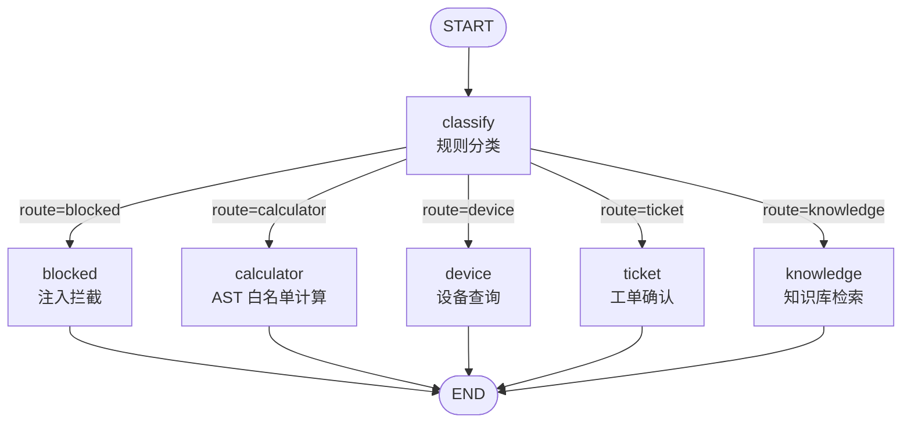

# 路由状态图（`graph.py`）

> 把 `src/support_agent/graph.py` 编译出来的图画清楚。
> 检查点与中断恢复实验见 `examples/graph_checkpoint_demo.py`。

## 图长什么样



## 三样东西各是什么

State（`AgentState`，`TypedDict`）是节点之间传递的唯一载体，谁能写哪些字段都摆在明面上：

| 字段 | 类型 | 谁写 | 含义 |
|---|---|---|---|
| `message` | `str` | 调用方 | 本轮用户输入原文 |
| `route` | `Route` | `classify` | 分流结果，只能是五个分支之一 |
| `device_sn` | `str \| None` | `classify` | 抽到的设备序列号，没有则 `None` |
| `expression` | `str \| None` | `classify` | 去掉「计算」前缀后的算式 |

`Route` 是 `Literal`，`ROUTES` 元组是它唯一的取值列表——节点注册和条件边都从这里取，所以不会出现「边指向一个没注册过的节点名」。

Node 是接收状态、返回增量更新的函数：

| 节点 | 实际做的事 |
|---|---|
| `classify` | 全图唯一有逻辑的节点：跑注入检测和规则匹配，填出 `route` / `device_sn` / `expression` |
| `blocked` `calculator` `device` `ticket` `knowledge` | 占位节点（`passthrough`），原样返回状态 |

占位节点不是偷懒：图负责「判断这是哪一类」，真正的动作在 `services/local_model.py` 里把 `route` 翻译成工具申请（`calculator` → `calculator`、`device` → `query_device`、`ticket` → `create_ticket`、其余 → `search_knowledge_base`）。这样拆开之后，改动作不动图，改判据不动动作。

Edge 是流转规则：

| 边 | 类型 |
|---|---|
| `START → classify` | 固定边，入口只有一个 |
| `classify → 五个分支` | 条件边，`lambda state: state["route"]` 决定走哪条 |
| `五个分支 → END` | 固定边，各自收口 |

## 这个图在什么时候才真被执行

只有**没有配置远程模型**、走 `RuleBasedLocalModel` 的时候。

配置了真实模型（`.env` 里的 `llm_*` 三项）之后，是模型自己看着工具说明决定调哪个工具，`graph.py` 不参与——它此时只是「离线演示与测试用的替代大脑」。这一点在 `README.md` 和 `docs/architecture.md` 里有对应的说明。

## 检查点：从「跑完就没了」到「可以停下来」

`build_route_graph(checkpointer=...)` 是加入检查点时的开关，默认 `None`，此时图与加入检查点之前完全一致。

传了检查点之后，行为有三处变化：

- 每一步状态都落成 checkpoint，`get_state(config)` 能取回最新状态；
- 必须带 `thread_id`，否则图不知道该写进哪个线程，直接抛 `ValueError`；
- 可以用 `interrupt_after=[...]` 让图停在某个节点之后，由 `invoke(None, config)` 从断点续跑——**这是「写操作需要人工确认」在图层面的实现方式**，也是 durable execution 与 replay 的基础。

实测输出（`python examples/graph_checkpoint_demo.py`）：

```text
[中断与恢复] 在 classify 之后停下，等人工确认
  第一次请求结束：route=ticket 下一步=('ticket',)
  此时进程可以退出，状态已经落在检查点里，不需要重新分类
  带同一个 thread_id 回来续跑：route=ticket 下一步=()
```

## 与数据库会话的区别

| | 数据库的 `Conversation` / `Message` | 图的 checkpoint |
|---|---|---|
| 存的是什么 | 用户看得见的对话 | 执行到哪一步、手上有什么状态 |
| 给谁看 | 用户、客服回看 | 引擎自己，用来恢复执行 |
| 生命周期 | 长期保留 | 按执行需要，用完可清 |
| 缺了会怎样 | 用户看不到历史 | 没法中断恢复，只能从头再跑一遍 |

两者不能互相替代：把 `route` 这类执行细节写进 `Message` 会污染对话记录，把用户可见的对话写进 checkpoint 会在换引擎时全部作废。
